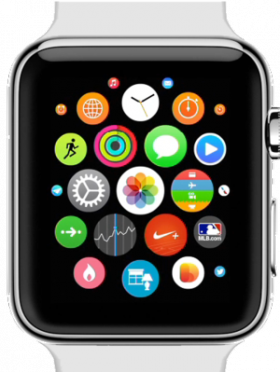

# Apple Watch Web Simulator

A web-based Apple Watch simulator that demonstrates the watch interface and gesture interactions using HTML5, CSS3, and JavaScript.



## 🚀 Live Demo

**[Launch the Apple Watch Simulator](http://binghuan.github.io/applewatch/)**

## ✨ Features

- **Realistic Apple Watch Interface**: Displays the Apple Watch home screen with authentic design
- **Touch Gesture Support**: Full gesture navigation system including:
  - **Swipe Up**: Access watch glances/complications
  - **Swipe Down**: Return to home screen
  - **Swipe Left/Right**: Navigate through different watch faces
  - **Hold**: Trigger scaling animation effects
- **Multiple Watch Faces**: Includes various watch complications:
  - Fitness tracker
  - Calendar
  - Location/Maps
  - World Clock
  - Weather

## 🎮 How to Use

1. Open the web app in your browser
2. Use touch gestures (on mobile) or mouse gestures (on desktop) to interact:
   - **Swipe up** from the home screen to view glances
   - **Swipe left/right** to browse through different watch faces
   - **Swipe down** to return to the main home screen
   - **Hold** on the screen for special effects

## 🛠 Technical Stack

- **Frontend**: HTML5, CSS3, JavaScript
- **UI Framework**: Bootstrap 3
- **Gesture Library**: QuoJS for touch/swipe detection
- **Animations**: jQuery UI for smooth transitions
- **Responsive Design**: Mobile-first approach with viewport optimization

## 🏗 Project Structure

```
applewatch/
├── index.html              # Main HTML file
├── js/
│   └── applewatch.js       # Main JavaScript logic and gesture handlers
├── images/                 # Watch face images and assets
├── components/             # Third-party libraries
│   ├── bootstrap/          # Bootstrap framework
│   ├── jquery/             # jQuery library
│   ├── jqueryui/          # jQuery UI for animations
│   └── quojs/             # Touch gesture library
└── Icons/                 # App icons for various devices
```

## 🚀 Getting Started

1. Clone the repository:
```bash
git clone https://github.com/binghuan/applewatch.git
```

2. Open `index.html` in your web browser or serve it via a local web server

3. For the best experience, use a mobile device or enable mobile device emulation in your browser's developer tools

## 📱 Browser Compatibility

- Modern mobile browsers (iOS Safari, Chrome Mobile, Firefox Mobile)
- Desktop browsers with touch simulation
- Responsive design works on various screen sizes

